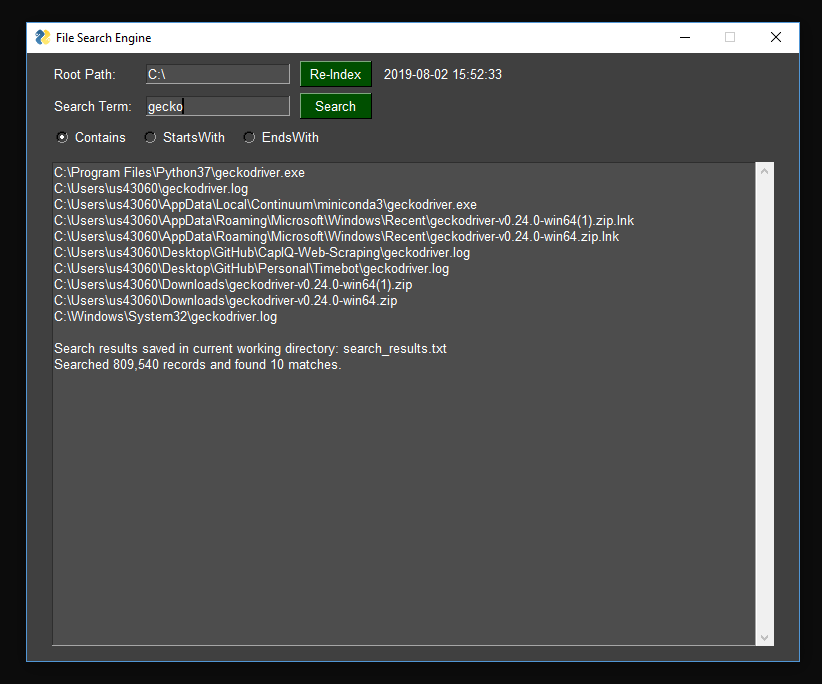

# File-Crawler
Index and search local files.

I plan on cleaning up the code down the road, so stay tuned. The current version uses a GUI. You can conver this into an executable with PyInstaller. I'll add a command-line interface version in the future.

A few notes:
- An index is saved in the working directory to enable quick searches when updating the index is not needed. I was able to index my laptop with almost 1 million files in under 20 seconds.  
- The search results are output on the screen and in a text file in the working directory (where you have your py file).  
- Requires [PySimpleGUI](https://pysimplegui.readthedocs.io/en/latest/) for the GUI `pip install PySimpleGUI`
 
 
